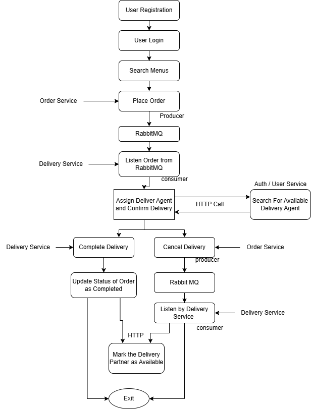

## 📊 Flow Diagram  
[View Flow Diagram](https://docs.google.com/document/d/1Lr6FhnN-_R8tHIpzIVAWKt4mG8if2IWknzshARyipK8/edit?usp=sharing)

## 📫 Postman API Documentation  
[View Postman Collection](https://documenter.getpostman.com/view/38864631/2sB2cVdM9J)

---
## 🔄 Data Flow Diagaram

---

## 🔄 Flow Summary

1. **User Registration**
2. **User Login**
3. **User Searches for Restaurants**
4. **User Searches for Menus**
5. **User Places an Order**
   - Order is pushed to RabbitMQ  
     `QueueName: MicroserviceOrderQueue`
   - User can cancel the order anytime before completion  
     `QueueName: MicroserviceCancelledOrderQueue`
     - On cancellation, the order ID is pushed to RabbitMQ

---

## 🚚 Delivery Service (Consumer)

- **Consumes new orders from:**  
  `QueueName: MicroserviceOrderQueue`

- **Process:**
  a. Search for available delivery partners from the **User Service** (role: Delivery Partner)  
  b. Select and assign a delivery partner  
  c. Upon successful delivery:
   - Update delivery status to `'Completed'` in **Delivery DB**
   - Communicate with:
     - **Order Service** to update `orderStatus` to `'Completed'` (via HTTP)
     - **Auth/User Service** to update `IsAvailable = true` for the delivery partner (via HTTP)

- **If the order is cancelled:**
  - Consume the order ID from:  
    `QueueName: MicroserviceCancelledOrderQueue`
  - Update delivery partner availability:
    - **Auth/User Service** sets `IsAvailable = true` (via HTTP)

---
